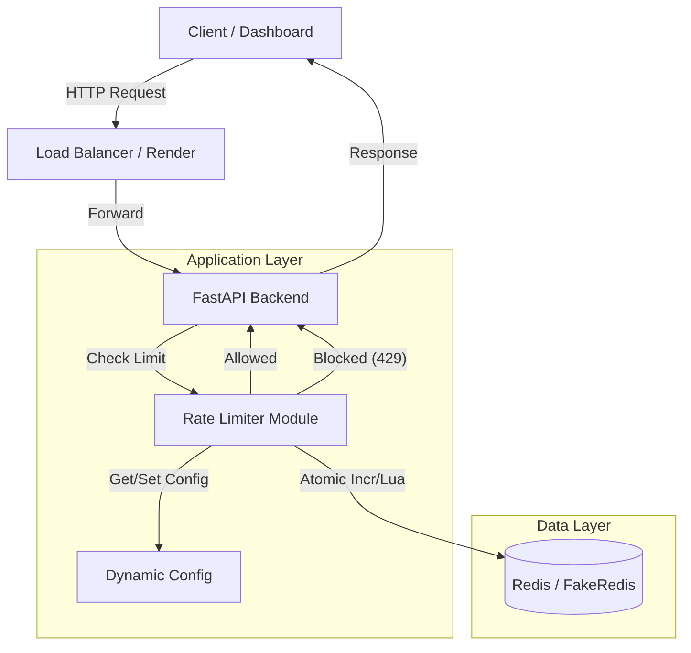
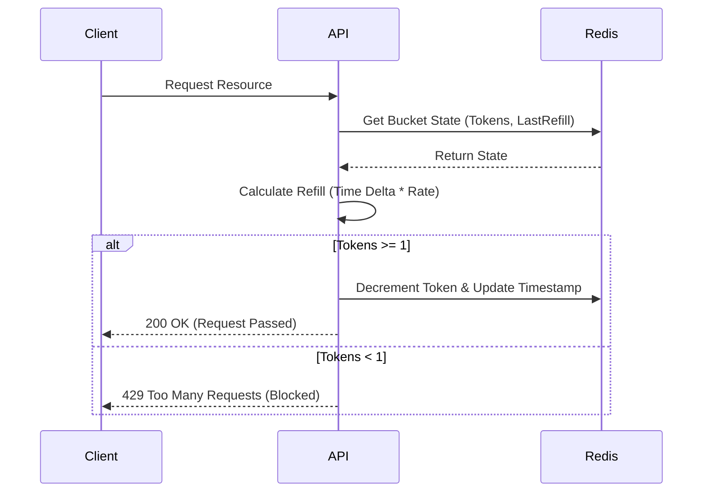
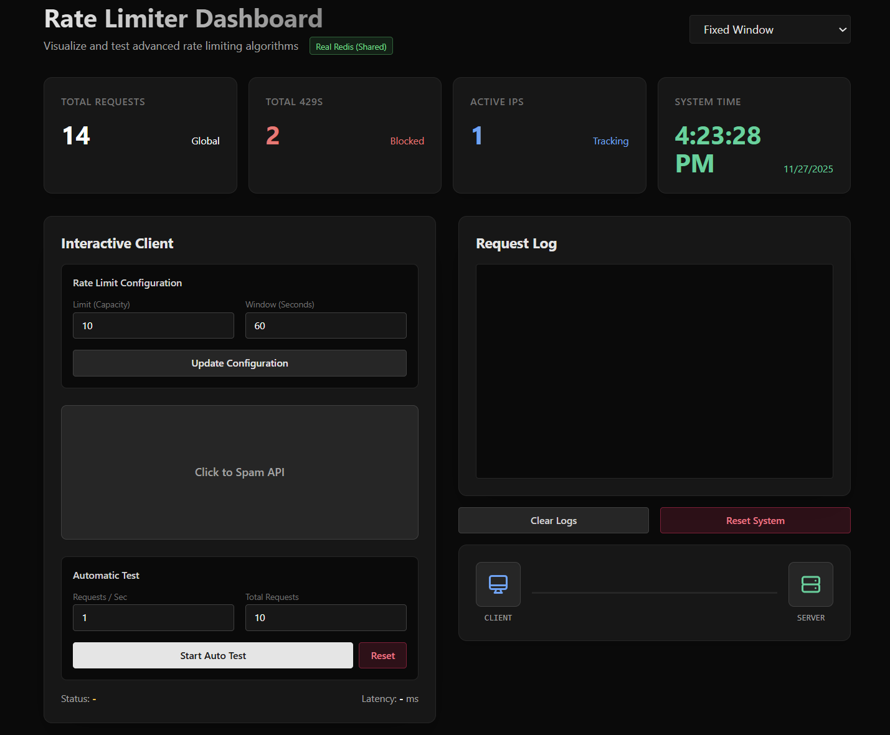

# 🚀 Distributed Rate Limiter System

## Link -> https://distributed-rate-limiter.onrender.com/

## open on google chrome browser since ip address is hashed to get unique id brave blocks it


> **A production-grade, distributed rate limiting solution built for high-concurrency environments.**

This project demonstrates a robust implementation of **5 industry-standard rate limiting algorithms**, capable of handling distributed traffic using **Redis** for state management. It features a **real-time interactive dashboard** built with React and Framer Motion to visualize traffic flow, algorithm behavior, and system metrics.

---

## 🌟 Key Features

-   **🛡️ 5 Advanced Algorithms**:
    -   **Fixed Window Counter**: Simple and memory-efficient.
    -   **Sliding Window Log**: Precision tracking (no boundary issues).
    -   **Sliding Window Counter**: Hybrid approach for optimal performance/accuracy.
    -   **Token Bucket**: Allows controlled bursts of traffic.
    -   **Leaky Bucket**: Smooths out traffic spikes (Queue-based).
-   **⚡ Distributed State Management**: Uses **Redis** (or FakeRedis for local dev) to maintain counters across multiple server instances, ensuring consistency in a microservices architecture.
-   **📊 Real-Time Dashboard**:
    -   **Live Metrics**: Watch requests, blocks (429s), and active IPs in real-time.
    -   **Traffic Visualizer**: Animated packet flow simulation.
    -   **Interactive Testing**: "Spam" the API manually or run auto-tests to see limits in action.
    -   **Dynamic Configuration**: Adjust limits and windows on the fly without restarting.
-   **🔍 Robust IP Detection**: Handles `X-Forwarded-For` headers correctly to identify clients behind load balancers (Render, Nginx, AWS ALB).

---

## 🏗️ System Architecture

The system is designed to be scalable and fault-tolerant.



---

## 📋 Requirements

### Functional Requirements

1.  **Multi-Algorithm Support**: The system must support Fixed Window, Sliding Window Log, Sliding Window Counter, Token Bucket, and Leaky Bucket algorithms.
2.  **Dynamic Configuration**: Administrators must be able to update rate limits (capacity and window size) in real-time without restarting the server.
3.  **Real-Time Monitoring**: A dashboard must visualize traffic spikes, blocked requests (429s), and active client IPs.
4.  **Distributed State**: Rate limits must be enforced consistently across multiple backend instances.
5.  **Client Identification**: The system must correctly identify clients via IP address, respecting `X-Forwarded-For` headers.

### Non-Functional Requirements

1.  **Low Latency**: The rate limiting check should add minimal overhead (< 10ms) to the request processing time.
2.  **Scalability**: The system should scale horizontally by adding more API instances, relying on a central Redis store.
3.  **Concurrency Control**: Race conditions must be prevented using atomic Redis operations or Lua scripts.
4.  **Fault Tolerance**: The system should handle Redis connection failures gracefully.
5.  **Accuracy**: The Sliding Window algorithms must provide precise boundary checks to prevent "boundary hopping" attacks.

---

## 💾 Database Schema (Redis)

Since this project uses **Redis** (Key-Value Store), there is no traditional SQL schema. Instead, we use specific **Key Patterns** to manage state.

| Key Pattern                   | Type               | Description                                                               | TTL                 |
| :---------------------------- | :----------------- | :------------------------------------------------------------------------ | :------------------ |
| `rate_limit:{algo}:{ip}`      | `String` / `Hash`  | Stores the counter or timestamp data for a specific client and algorithm. | Matches Window Size |
| `rate_limit:{algo}:{ip}:logs` | `Sorted Set`       | **(Sliding Window Log)** Stores timestamps of individual requests.        | Matches Window Size |
| `leaky_bucket:{ip}`           | `List`             | **(Leaky Bucket)** Queue representing the bucket of pending requests.     | N/A                 |
| `config:rate_limit`           | `String` (JSON)    | Stores the current global configuration (Limit & Window).                 | Persistent          |
| `global:total_requests`       | `String` (Counter) | Global counter for all incoming requests.                                 | Persistent          |
| `global:total_429s`           | `String` (Counter) | Global counter for all blocked requests.                                  | Persistent          |
| `global:active_ips`           | `Set`              | Set of all unique IP addresses seen by the system.                        | Persistent          |

---

## 🧠 Algorithm Logic: Token Bucket

Here is how the **Token Bucket** algorithm—one of the most popular strategies—is implemented to handle bursts.



---

## 🚀 Getting Started

### Prerequisites

-   **Python 3.9+**
-   **Node.js 16+** (for Frontend)
-   **Redis** (Optional, falls back to in-memory FakeRedis)

### 1. Clone the Repository

```bash
git clone https://github.com/yourusername/rate-limiter.git
cd rate-limiter
```

### 2. Backend Setup (FastAPI)

```bash
# Create virtual environment
python -m venv venv
source venv/bin/activate  # or venv\Scripts\activate on Windows

# Install dependencies
pip install -r requirements.txt

# Run the server
uvicorn app.main:app --reload
```

_The API will start at `http://localhost:8000`_

### 3. Frontend Setup (React + Vite)

```bash
cd frontend

# Install dependencies
npm install

# Run the development server
npm run dev
```

_The Dashboard will open at `http://localhost:5173`_

---

## 🛠️ Technology Stack

| Component      | Technology        | Description                                    |
| :------------- | :---------------- | :--------------------------------------------- |
| **Backend**    | **FastAPI**       | High-performance, async Python framework.      |
| **Database**   | **Redis**         | In-memory key-value store for atomic counters. |
| **Frontend**   | **React + Vite**  | Modern UI library with fast build tooling.     |
| **Styling**    | **TailwindCSS**   | Utility-first CSS for rapid design.            |
| **Animation**  | **Framer Motion** | Smooth, physics-based animations.              |
| **Deployment** | **Render**        | Cloud hosting for full-stack apps.             |

---

## 🧪 API Endpoints

| Method | Endpoint             | Description                                           |
| :----- | :------------------- | :---------------------------------------------------- |
| `GET`  | `/api/image/{w}/{h}` | **Protected Resource**. Returns a placeholder image.  |
| `GET`  | `/api/monitor`       | Returns global system metrics (Total Requests, 429s). |
| `POST` | `/api/config`        | Dynamically updates Rate Limit (Limit, Window).       |
| `POST` | `/api/reset`         | Resets all Redis counters and configurations.         |
| `GET`  | `/api/health`        | Checks Redis connectivity.                            |

---

## 📸 Screenshots

_(Add screenshots of your dashboard here)_

## 

## 🤝 Contributing

Contributions are welcome! Please fork the repository and submit a Pull Request.

## 📄 License

MIT License © 2025
